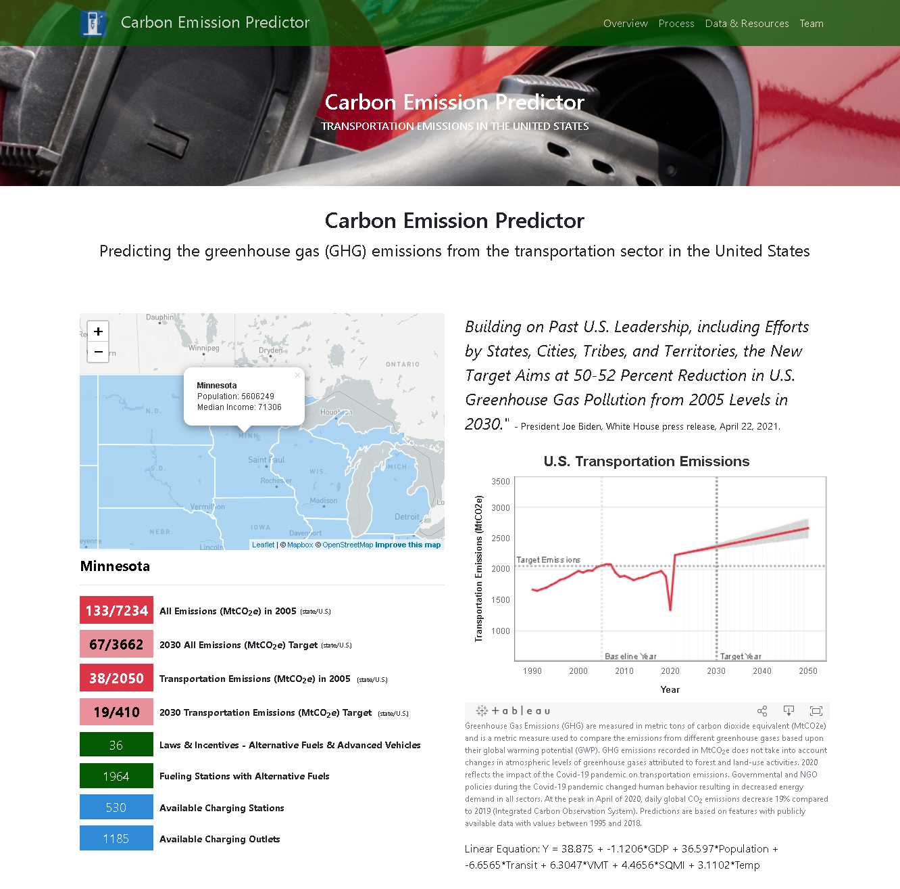

# Project-3-Carbon Emissions Predictor
## TRANSPORTATION EMISSIONS IN THE UNITED STATES

This project uses machine learning to determine the predictability of carbon emissions in the transportation sector if trends in person vehicle and public transportation continues.

### View the <a href ="https://nbullerds.github.io/ml_co_emission_equiv_prediction" target="_blank">Carbon Emissions Predictor</a> on GitHup Pages.
---

## Project Team
* Nick Buller: <a href="https://github.com/nbullerds" target="_blank">github.com/nbullerds</a> / <a href="mailto:nabuller@gmail.com">nabuller@gmail.com</a>
* Kerry Harp: <a href="https://github.com/klharp" target="_blank">github.com/klharp</a> / <a href="mailto:kharp@umn.edu">kharp@umn.edu</a>
* Matt Killeen: <a href="https://github.com/matthewkilleen0830" target="_blank">github.com/matthewkilleen0830</a> / <a href="matthew.killeen0830@gmail.com">matthew.killeen0830@gmail.com</a>
* Ciera Morris: <a href="https://github.com/cieranmorris" target="_blank">github.com/cieranmorris</a> / <a href="mailto:cieranmorris@gmail.com">cieranmorris@gmail.com</a>

---

## Overview

Transportation makes up 29% of the total U.S. greenhouse gas emissions. In April of 2021, President Biden announced a target of 50-52% reduction in emissions from  2005 levels. Are we on track for meeting this goal in the transportation sector and what are the factors that have the biggest impact on meeting this goal?

Data from various sources was used to test-train a dataset to determine the predictability of greenhouse gas (GHG) emissions due to transportation.

 

---

## Process
This project showcases using machine learning to make a prediction and  uses visualizations to provide the user an interactive means to explore data relevant to the prediction.

<b>Predictive Data Analysis with Multiple Linear Regression Machine Learning</b>

Using a multiple linear regression approach, our objective was to predict GHG emissions from the transportation sector for the (5) state area known as the upper Midwest (Iowa, Minnesota, North Dakota, South Dakota, and Wisconsin).  We compiled annual transportation data for features such as vehicle miles traveled, total fuel consumption, and electric vehicle market share for each state from 1990 to 2018.  While this dataset contained roughly (16) features for each state, it was limited in terms of the amount of data to train and test a multiple linear regression model.  Ultimately, we were not satisfied with the accuracy scores of our model and we brainstormed for new ideas.

Going forward, we had decided to take the element of state-by-state data out of the model.  We then located data for the features of Gross Domestic Product, population, mass transit ridership, vehicle miles traveled, landmass area, and average high temperatures for all (50) states.  This provided us a dataset that was much more suitable for training and testing a multiple linear regression model.  The accuracy scores of the model drastically improved, and using forward looking trendlines for each feature, we were satisfied that we could accurately forecast and predict future GHG emissions through the year 2050.

<b>Regression Methodology</b>

The regression equations were developed to determine annual GHG emissions from the transportation sector in the United States.

Our regression equation was developed using the formula:

&nbsp;&nbsp;&nbsp;&nbsp;&nbsp;&nbsp;&nbsp;&nbsp;y = b0 + b1(X1) + b2(X2) … b5(X5) + b6(X6)

Where:

&nbsp;&nbsp;&nbsp;&nbsp;&nbsp;&nbsp;&nbsp;&nbsp;y = annual GHG emissions from the transportation sector (dependent variable)

&nbsp;&nbsp;&nbsp;&nbsp;&nbsp;&nbsp;&nbsp;&nbsp;X1 through X6 = distinct independent predictor variables

&nbsp;&nbsp;&nbsp;&nbsp;&nbsp;&nbsp;&nbsp;&nbsp;b1 through b6 = estimated regression coefficients
	
&nbsp;&nbsp;&nbsp;&nbsp;&nbsp;&nbsp;&nbsp;&nbsp;b0 = the value of y when all independent predictor variables (X values) are equal to zero

Linear Equation: Y = 38.875 + -1.1206*GDP + 36.597*Population + -6.6565*Transit + 6.3047*VMT + 4.4656*SQMI + 3.1102*Temp

<b>Website &amp; Visualizations</b>

The website uses a Bootstrap template with customized HTML, CSS, and Javascript.

The map is rendered from a final GeoJSON file that was exported from Pandas as a shape file after merging a GeoJSON and a CSV file. That shape file was then converted to a GeoJSON using an online converter. The click events are in Javascript, reference the merged GeoJSON, and render in the HTML.

The U.S. Transportation Emissions graphic uses the machine learning data (from the multi-variable regression). This visualization displays the transportation emissions into the future, the margin of error, and the 2030 emission target. This graphic was created from the Machine Learning data exported in CSV format from Pandas then imported into Tableau. Code from Tableau was copied and embedded in the HTML.

The data for the graphics in the Overview section was compiled from multiple sources into in a CSV file and then imported into Tableau. Code from Tableau was copied and embedded in the HTML. These graphics give a visual and interactive overview of transportation use in the United States.

<b> Assumptions</b>

* GHG emissions recorded in MtCO2e (metric tons CO2 equivalent) and does not take into account changes in atmospheric levels of greenhouse gases attributed to forest and land-use activities.

* Predictions are based on features with publicly available data with values between 1995 and 2018.

---

## Project Focus
* Working as a team, demonstrated by using branches in GitHub to manage the push/merge/pull of the repository, acquiring datasets, coordinating efforts to develop the machine learning model, and preparing information for display/presentation.

* Acquiring the datasets from multiple sources.

* ETL of chosen datasets.

* Developing a machine learning model using multi-linear regressions to predict an outcome.

* Creating visualizations used to demonstrate the project's intent.

* Creating a website and deploying to GitHub Pages.

* Languages and libraries used:
    * Python
    * Pandas
    * GeoPandas
    * Numpy
    * Matplotlib
    * Seaborn
    * Scikit-learn
    * Beautiful Soup
    * HTML
    * CSS
    * Bootstrap
    * D3
    * Javascript / Requests (JSON)
    * Leaflet
    * Tableau

---

## Sources

* <a href="https://carbonmonitor.org/" target=" _blank">Carbon Monitor</a>

* <a href="https://www.epa.gov/" target="_blank">Environmental Protection Agency (EPA)</a>

* <a href="https://www2.census.gov/" target="_blank">U.S. Census Bureau</a>

* <a href="https://afdc.energy.gov/" target="_blank">U.S. Department of Energy Alternative Fuels Center</a>

* <a href="https://www.bts.gov/" target="_blank">Bureau of Transportation Statistics</a>

* <a href="https://www.ncdc.noaa.gov/cag/" target="_blank">NOAA National Centers for  Environmental information</a>

* <a href="https://www.ipcc.ch" target="_blank">Intergovernmental Panel on Climate Change</a>

* <a href="https://unfccc.int" target="_blank">United Nations Climate Change</a>

---

Copyright &copy; 2021: Buller, Harp, Killeen, Morris